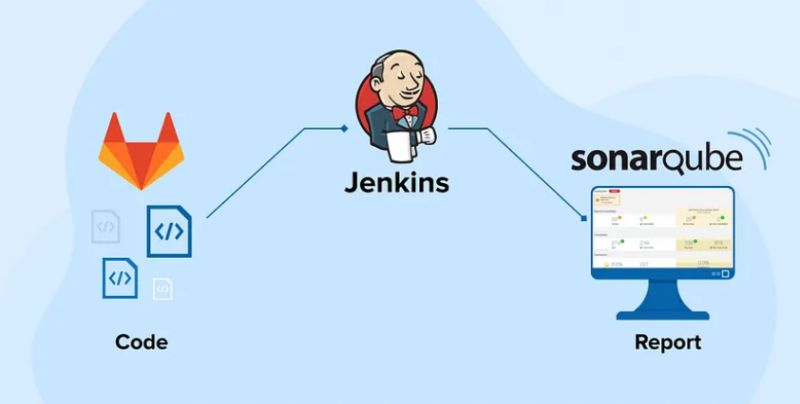
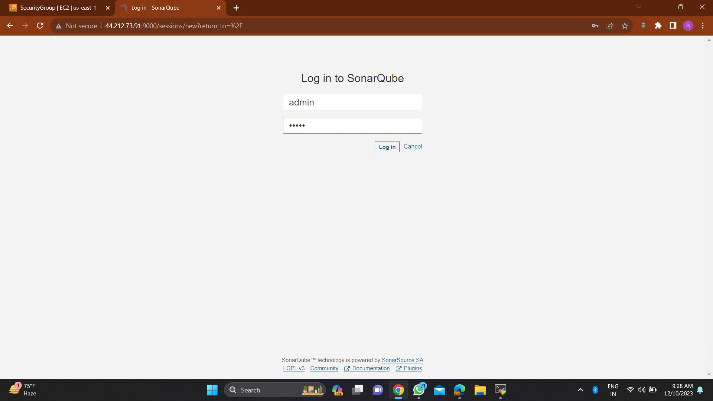
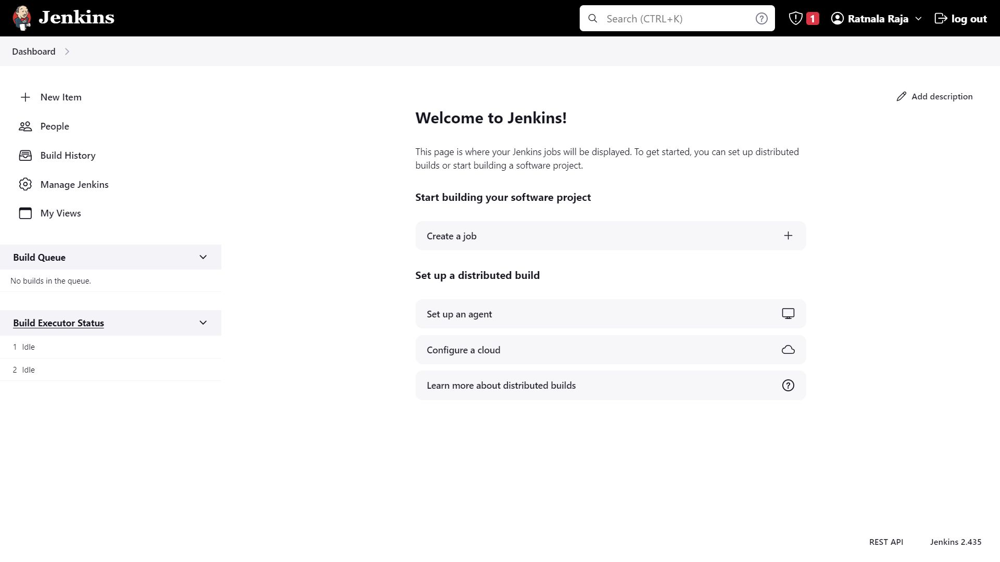
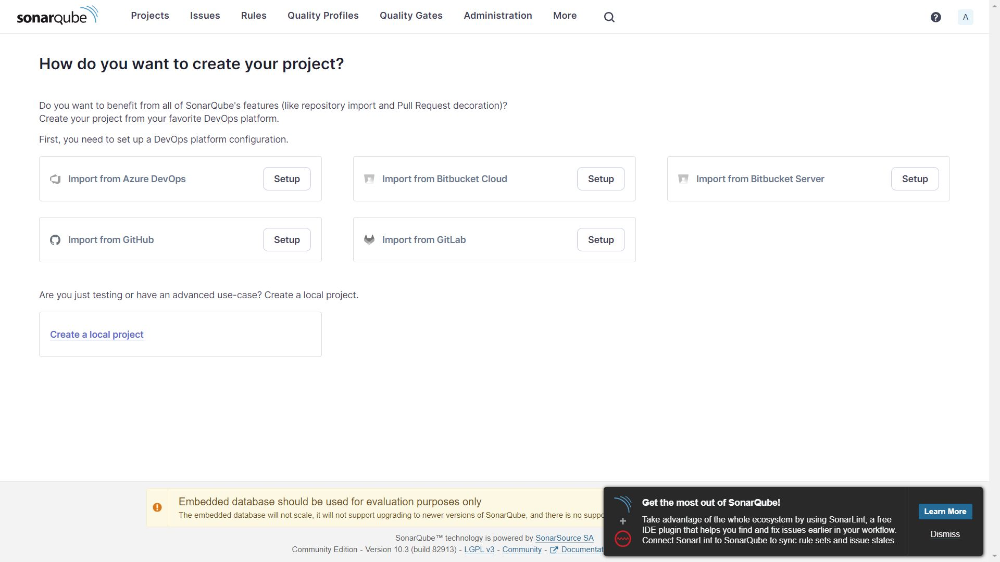
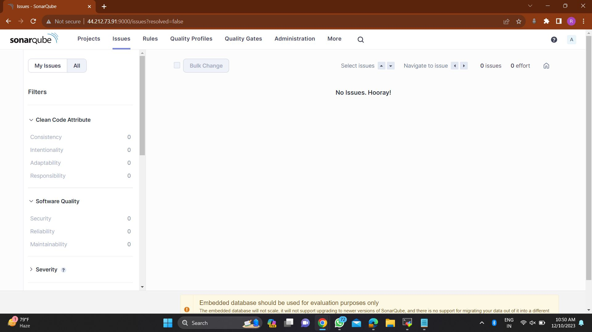

 # SonarQube-Jenkins Integration



The SonarQube-Jenkins Integration repository provides a detailed guide to integrating SonarQube with Jenkins, enabling automated code quality analysis. This project includes step-by-step instructions and code examples to help set up SonarQube and Jenkins in your development environment.

## Table of Contents

- [Overview](#overview)
- [Requirements](#requirements)
- [Installation](#installation)
- [How to Use](#how-to-use)
- [Contributing](#contributing)
- [License](#license)

## Overview

Maintaining high code quality and security is crucial for any software project. This repository showcases how to integrate SonarQube, a powerful platform for code quality analysis, with Jenkins for automated code quality checks. This guide will help you improve code integrity, reduce vulnerabilities, and ensure your project's success.

## Requirements

Before starting, ensure you have the following:

- Docker installed.
- Jenkins installed.
- Basic knowledge of Docker and Jenkins.
- Access to a SonarQube instance (local or remote).

## Installation

### Installing SonarQube Using Docker:

1. **Pull the SonarQube Docker image:**
   
   ```sh
   docker pull sonarqube
   ```

2. **Run the SonarQube container:**
   
   ```sh
   docker run -d --name sonarqube -p 9000:9000 sonarqube
   ```

3. **Access SonarQube:**
   
   Open your browser and navigate to [http://localhost:9000](http://localhost:9000). Use the default credentials:

   - Username: admin
   - Password: admin



### Installing Jenkins:

Follow the installation instructions provided on the [official Jenkins website](https://jenkins.io/doc/book/installing/).

### Installing the SonarQube Scanner Plugin in Jenkins:

1. Navigate to `Manage Jenkins` > `Manage Plugins`.
2. In the `Available` tab, search for "SonarQube Scanner" and install it.

### Configuring SonarQube in Jenkins:

1. Go to `Manage Jenkins` > `Configure System`.
2. Scroll to the `SonarQube Servers` section.
3. Click `Add SonarQube` and enter your SonarQube details (Server URL, Authentication Token).

### Configuring a Jenkins Job:



1. Create a new Jenkins job or open an existing one.
2. In the `Build` section, add `Execute SonarQube Scanner` as a build step.
3. Configure the necessary analysis properties. For a Maven project, it might look like:

   ```properties
   sonar.projectKey=myproject
   sonar.sources=src
   sonar.java.binaries=target/classes
   ```

### Testing the Setup:



Trigger a Jenkins build to ensure that SonarQube analysis is performed correctly.

## How to Use

After completing the setup, use the SonarQube and Jenkins integration for automated code quality analysis. Common use cases include:

- **Automated Code Quality Checks:**
  
  

  Automatically trigger code quality checks with every build, providing continuous feedback.

- **Detecting and Fixing Issues Early:**
  
  Identify code smells, bugs, and vulnerabilities before they reach production.

- **Maintaining High Code Standards:**
  
  Enforce coding standards and best practices across your development team.

Refer to the documentation and code samples for more details on integrating and using this setup in your projects.

## Contributing

Contributions are welcome! If you have improvements, bug fixes, or new features to suggest, please open an issue or submit a pull request. Follow the contributing guidelines provided in the repository.

## License

This project is licensed under the MIT License. You are free to use, modify, and distribute this project under the terms of the license.

*Disclaimer: This project is for educational and demonstration purposes. Be mindful of your resources and consider best practices for security and privacy when handling code and data.*